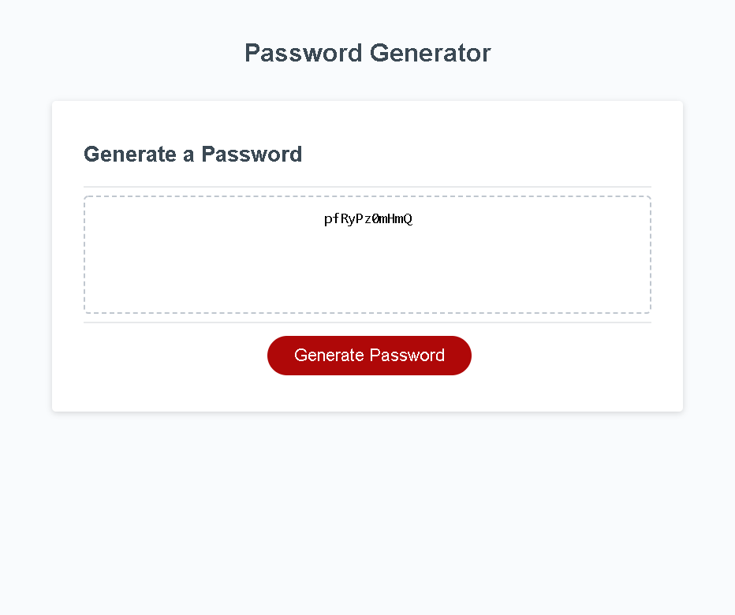

# password-generator

## Purpose

This website can generate secure passwords based on user inputs. Clicking the button prompts a series of windows the use must put information into, and then generates a password based on them.

## Built With

- HTML
- CSS
- JavaScript

## GitHub Repository

[GitHub Repo](https://github.com/dolcebasstrombone/password-generator)

## Website

[Live Page](https://dolcebasstrombone.github.io/password-generator/)

## Application Screenshot

## Grading Requirements
